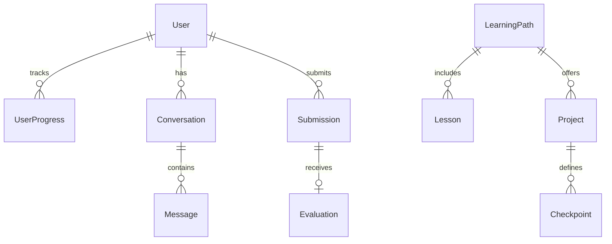
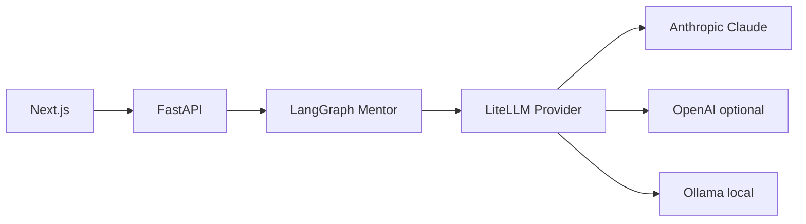

# AI Forge — Architecture

## Vision

AI Forge teaches AI engineering through **building**, not passive video. Each module includes concepts, architecture diagrams, guided milestones, evaluation, and deployment instructions.

## Monorepo layout

```
ai-forge/
├── backend/                 # FastAPI + SQLAlchemy + LangGraph
│   └── app/
│       ├── api/v1/routes/   # REST endpoints
│       ├── agents/          # LangGraph graphs
│       ├── core/            # config, database
│       ├── models/          # PostgreSQL ORM
│       ├── services/        # mentor, LLM provider
│       └── scripts/seed.py  # first path + RAG project
├── frontend/                # Next.js 15 + Tailwind
│   └── app/                 # App Router pages
├── docker-compose.yml
├── Makefile
└── .env.example
```

## Phase roadmap

### Phase 1 (current)

- Dev auth via request headers (`X-Forge-User-Id`, `X-Forge-Email`)
- PostgreSQL schema: users, projects, checkpoints, conversations, submissions
- LiteLLM provider abstraction (Claude primary)
- LangGraph mentor graph (single-node, extensible)
- Seed: learning path + **Build a RAG Assistant** with 4 checkpoints
- Next.js: landing, dashboard, mentor, projects

### Phase 2

- Docker sandbox execution (Python/Node, websocket logs)
- Qdrant RAG ingestion + semantic search for course content
- Celery + Redis for async jobs
- DeepEval / rubric-based evaluation engine
- Clerk or Auth.js production auth

### Phase 3

- Multi-agent orchestration (architect, debugger, deployment, research)
- GitHub repo creation + PR review
- Portfolio generator
- Deployment walkthroughs (Railway, Render, AWS)

## Data model (Phase 1)



## AI stack



**Mentor behavior:** personalities (teacher, architect, debugger, interviewer, reviewer) inject system prompts. The mentor uses Socratic questioning — hints before full solutions.

## Security (Phase 1)

- CORS allow-list
- No secrets in repo (`.env` gitignored)
- Sandbox isolation deferred to Phase 2
- Rate limiting planned at API gateway

## Integration with OnePercent

Streamlit app (`app.py`) exposes **AI Forge** on Rakesh's dashboard. It does not embed the Next app; it links to `AIFORGE_PUBLIC_URL` so AI Forge can be deployed independently.
